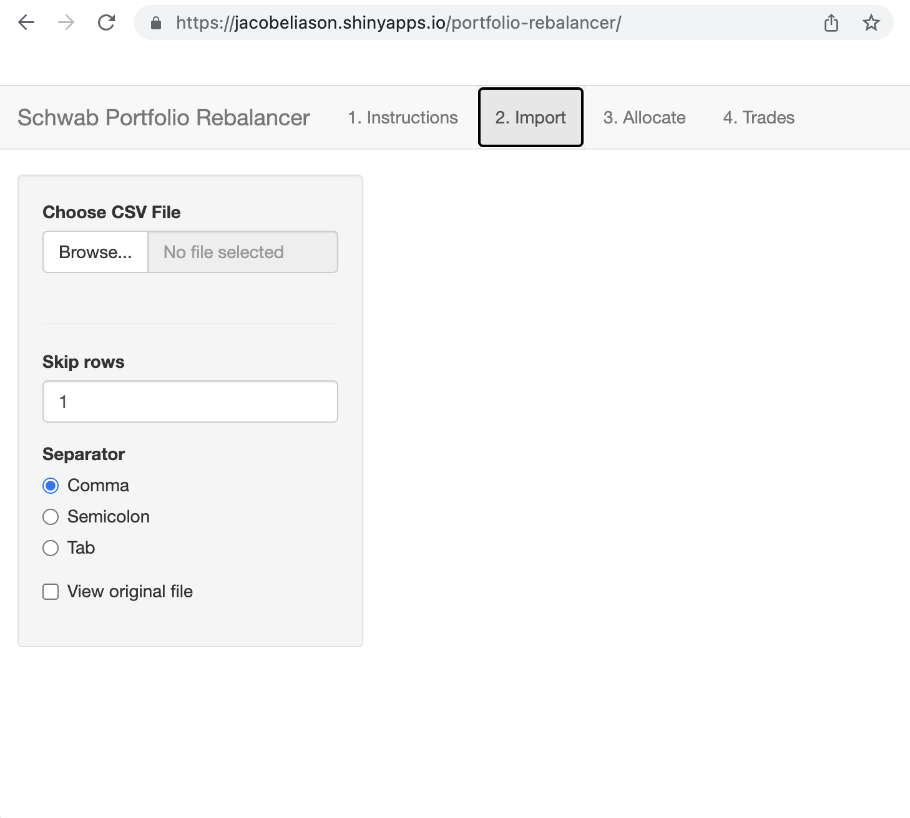

portfolio-rebalancer
================

## About

This repository contains code for a very simple R Shiny app which visualizes planned changes in a Charles Schwab investment account and assists in the arithmetic needed to manually rebalance assets.

## Screenshots

